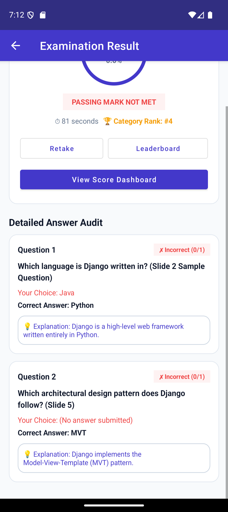
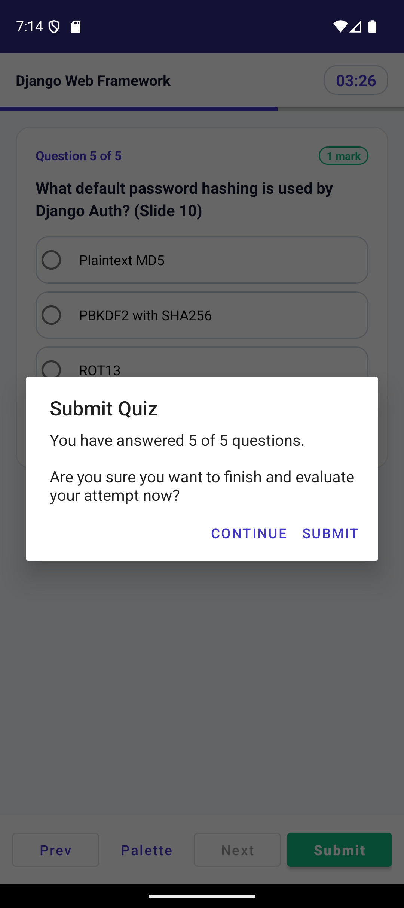

# QuizSphere — Student Java Android Mobile App
### Clean, Lightweight Quiz & Assessment Platform

**Based on:** `QuizSphere_Final.pptx`  
**Features:** Student-Only Edition (Lean & Focused)  
**Technology:** Java, Android SDK, SQLite (`SQLiteOpenHelper`), Material Components, RecyclerView, CountDownTimer  
**Presented by:**
- **Giri Siddharth** (Roll No: `40013`)
- **Ankit Singh** (Roll No: `40003`)
- **Raju Ranjan Choudhary** (Roll No: `40043`)

---

## 📱 Pre-Compiled Student APK Ready to Install

The student edition APK is built and ready in the repository:
📁 **`app-debug.apk`** (Pre-compiled APK)

To install onto any Android phone or emulator:
```cmd
adb install -r app-debug.apk
```

---

## 🎯 Clean Student Features

1. **Student Sign In & Sign Up (`LoginActivity.java`, `RegisterActivity.java`)**:
   - Single-step registration as a student learner.
   - 1-Tap quick demo fill button for instant login (`student` / `student123`).
2. **Main Hub (`MainActivity.java`)**:
   - Displays student greeting, platform statistics, Slide 2 problem & solution overview, and sample question demo.
3. **Category Selection (`CategoryListActivity.java`)**:
   - Real-time search filter for Django, Python, Web Tech, Database Systems.
4. **Pre-Quiz Briefing (`QuizDetailActivity.java`)**:
   - Exam rules, time limit, question count, pass percentage, and previous best score badge.
5. **Timed Examination Engine (`QuizTakeActivity.java`)**:
   - Real-time `CountDownTimer` (mm:ss), progress bar, option radio buttons, question palette, and **automatic submission at 00:00**.
6. **Instant Auto-Grading (`QuizResultActivity.java`)**:
   - Circular score ring, percentage, pass/fail status, and question-by-question audit review (green for correct, red for incorrect, and explanations).
7. **Competitive Leaderboard (`LeaderboardActivity.java`)**:
   - Global and category-wise rankings with 🥇 Gold, 🥈 Silver, and 🥉 Bronze medals.
8. **Student Score Dashboard (`DashboardActivity.java`)**:
   - 4 metric cards: Total Quizzes, Passed Assessments, Pass Rate %, Top Score %, plus full history review.
9. **Presentation Showcase (`PresentationShowcaseActivity.java`)**:
   - Interactive 12-slide walkthrough with Next/Prev navigation and team roll numbers (`40013`, `40003`, `40043`).

---

## 🚀 How to Open in Android Studio

1. Launch Android Studio.
2. Click **File** -> **Open...** -> Choose the `QuizSphere_Mobile` project root folder.
3. Press **Run ▶** (`Shift + F10`) to test on your phone or emulator.

---

## 📸 App Previews

| Active Screen Preview | Quiz / Dialog Confirmation |
|:---:|:---:|
|  |  |

---

## 📊 Presentation Slides

Slide previews from the project presentation are available in the [`slides_preview/`](slides_preview/) directory.
To regenerate the slide deck via PowerPoint COM automation:
```powershell
.\generate_presentation.ps1
```
